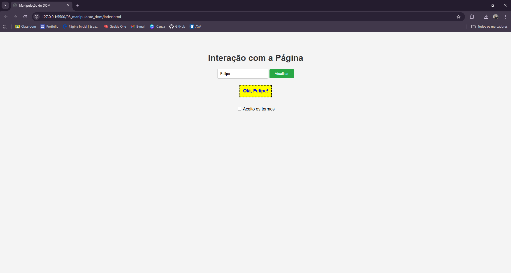

# 🚀 Manual Prático de JavaScript

Bem-vindo ao meu repositório de estudos! Este guia foi criado para documentar meu aprendizado sobre JavaScript, explicando desde conceitos básicos até a interação com o navegador.

---

## 📑 Sumário
1. [Introdução](#-introducao)
2. [Formas de Uso](#-formas-de-uso-html)
3. [Variáveis e Escopo](#-variaveis-e-escopo)
4. [Operadores e Comparações](#-operadores-e-comparacoes)
5. [Estruturas Condicionais](#-estruturas-condicionais)
6. [Estruturas de Repetição](#-estruturas-repeticao)
7. [Funções](#-funcoes)
8. [Manipulação do DOM](#-manipulacao-dom)

---

## 🌟 Introdução
O **JavaScript** é a linguagem que traz interatividade para a web.
- **Função:** Enquanto o HTML estrutura e o CSS embeleza, o JS controla o comportamento.
- **Exemplo:** Validar se um e-mail é válido antes de enviar um formulário.

---

## 🔌 Formas de Uso
Existem duas formas principais de integrar o JS ao HTML:
1. **Interno:** O código fica direto na tag `<script>` (Pasta `01`).
2. **Externo:** O código fica em um arquivo `.js` separado (Pasta `02`).
*O uso externo é preferível para manter o código limpo e reutilizável.*

---

## 📦 Variáveis e Escopo
Aprendi a diferença crucial entre as formas de declarar variáveis:

- **var:** Escopo global/função (pode causar bugs por "vazar" de blocos).
- **let:** Escopo de bloco (mais seguro, recomendado para valores que mudam).
- **const:** Escopo de bloco (para valores que nunca mudam).

> **Nota sobre Escopo:** No exemplo da pasta `03`, demonstrei que uma variável `let` criada dentro de um `if` não pode ser acessada fora dele, gerando um erro proposital para fins de aprendizado.

---

## ⚖️ Operadores e Comparações
Uma das regras de ouro do JS é a comparação estrita:

- `5 == "5"`: Retorna **true** (compara apenas o valor).
- `5 === "5"`: Retorna **false** (compara valor e o tipo de dado).

**Por que usar `===`?** Ele evita erros silenciosos onde o JS tenta converter tipos de forma automática, garantindo que "5" (texto) não seja tratado como 5 (número).

---

## 🔄 Estruturas de Controle
- **Condicionais:** Usei `if/else` para decisões simples e `switch` para múltiplas opções (Ex: menu de opções).
- **Repetição:** Usei `for` para contagens exatas e `while` para repetições baseadas em uma condição.
*(Veja pastas `05` e `06`)*

---

## ⚙️ Funções
As funções são blocos de código que executam tarefas. No projeto, demonstrei:
- Funções simples (sem parâmetros).
- Funções com parâmetros (recebem dados).
- Funções com **retorno** (devolvem um resultado).

---

## 🖱️ Manipulação do DOM
O ponto alto do JS é controlar o HTML. Nesta seção usei:
- `document.getElementById()` e `querySelector()` para achar elementos.
- `.addEventListener()` para reagir a cliques.
- `.style` e `classList` para mudar o design dinamicamente.

### 📸 Exemplo de Funcionamento:

*Pasta: `08_manipulacao_dom/`*

---

## 📚 Referências

MDN Web Docs. **JavaScript**. 2026. Disponível em: https://developer.mozilla.org/pt-BR/docs/Web/JavaScript. Acesso em: 30 mar. 2026.

W3SCHOOLS. **JavaScript Tutorial**. 2026. Disponível em: https://www.w3schools.com/js/. Acesso em: 30 mar. 2026.

ECMA INTERNATIONAL. **ECMAScript® 2026 Language Specification**. 2026. Disponível em: https://www.ecma-international.org/publications-and-standards/ecma-262/. Acesso em: 31 mar. 2026.

SILVA, Gustavo Guanabara. **Curso de JavaScript**. YouTube, 2026. Disponível em: https://www.youtube.com/c/CursoemVídeo. Acesso em: 31 mar. 2026.